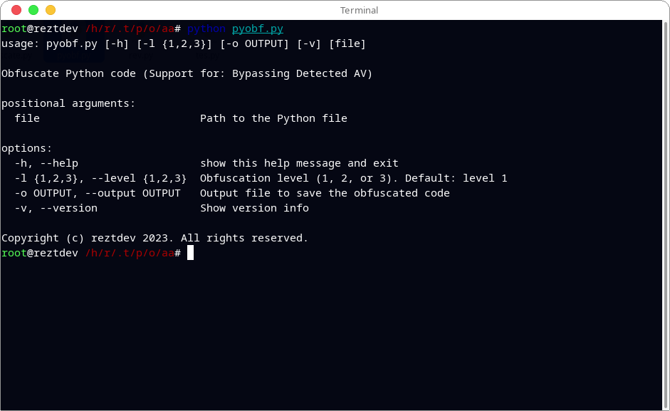
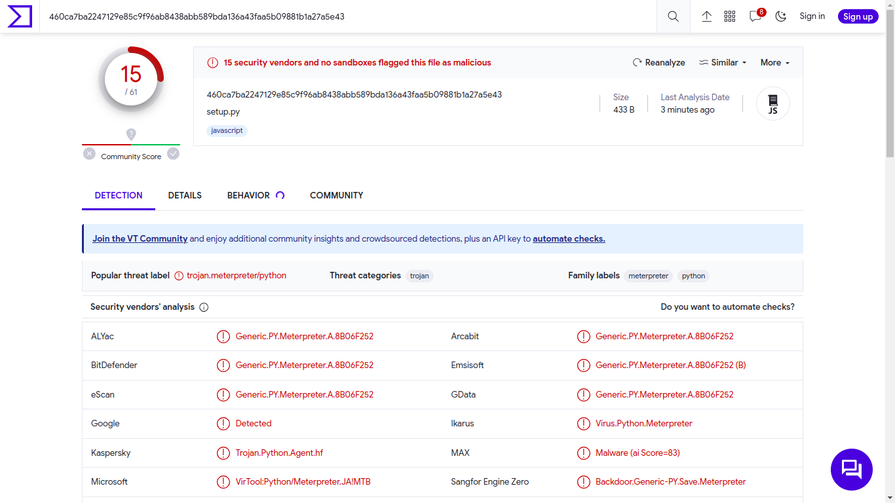
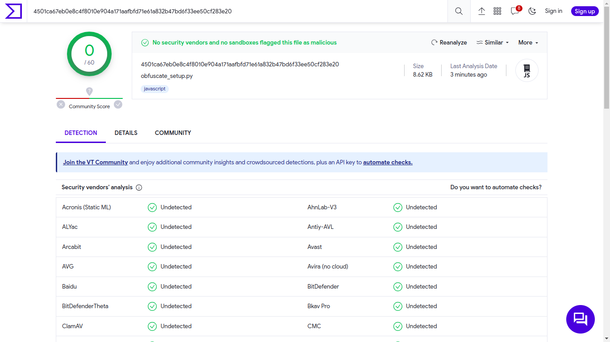

<h1 align="center">Phiou Obfuscate</h1>

Obfuscator code is only for python language and support for bypassing protection by Antivirus. Custom encrypt your payload, hide the code you create so it doesn't get misused and much more. But, you need to know that this only applies to the Python language. In the future, I will add more features.

I was inspired by CTF 2022 reverse engineering [`CTF2022-Reverse-Engineering`](https://github.com/evyatar9/Writeups/tree/master/CTFs/2022-picoCTF2022/Reverse_Engineering/200-bloat.py)

- I will show you some pictures 
  <h3 font="bold">Before obfuscate</h3>
  
  

  <h3 font="bold">After obfuscate</h3>
  
  

<h2 color="cyan">Thank you for visiting have a nice day!!</h2>

- Support for my coffee
  
  Donate with [`Paypal`](https://paypal.me/RyzkiAlvaro)
  
  Donate with [`Saweria`](https://saweria.co/reztdev)
